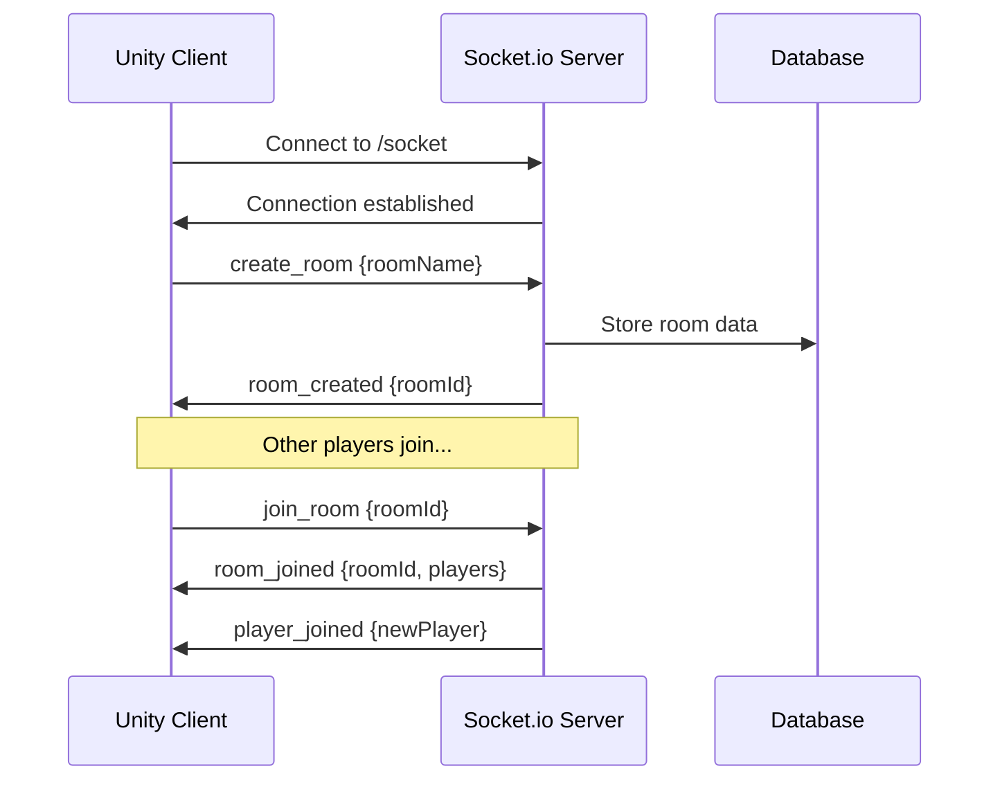

# Networking Architecture

## Overview

The MiniGameHub uses a **hybrid networking approach** combining REST API for management operations and WebSocket for real-time gameplay.

## Connection Flow



## Socket.io Events

### Client → Server Events

| Event | Payload | Description |
|-------|---------|-------------|
| `ping` | `{timestamp}` | Connection test |
| `create_room` | `{roomName, gameType?}` | Create new game room |
| `join_room` | `{roomId}` | Join existing room |
| `leave_room` | `{roomId}` | Leave current room |
| `player_ready` | `{roomId, isReady}` | Toggle ready state |
| `game_action` | `{action, data}` | In-game actions |
| `player_position` | `{x, y, z, rotation}` | Position updates |

### Server → Client Events

| Event | Payload | Description |
|-------|---------|-------------|
| `pong` | `{timestamp, latency}` | Ping response |
| `room_created` | `{roomId, roomName}` | Room creation success |
| `room_joined` | `{roomId, players[]}` | Joined room successfully |
| `player_joined` | `{playerId, playerName}` | New player joined |
| `player_left` | `{playerId}` | Player left room |
| `game_started` | `{gameType, settings}` | Game session started |
| `player_update` | `{playerId, position, state}` | Player state sync |
| `game_ended` | `{results, scores}` | Game session ended |
| `error` | `{code, message}` | Error occurred |

## Ghost Player System

### Design Principles
1. **No Direct Collision**: Players cannot physically interact
2. **Visual Only**: Ghost players are translucent representations
3. **Score-Based Competition**: Competition through scores, not physics
4. **Lag Compensation**: Interpolation and prediction for smooth movement

### Implementation

```csharp
// Unity Client - Ghost Player Rendering
public class GhostPlayer : MonoBehaviour
{
    [SerializeField] private float opacity = 0.5f;
    [SerializeField] private float interpolationSpeed = 10f;
    
    private Vector3 targetPosition;
    private Quaternion targetRotation;
    
    public void UpdateGhostState(Vector3 position, Quaternion rotation)
    {
        targetPosition = position;
        targetRotation = rotation;
    }
    
    void Update()
    {
        // Smooth interpolation to target position
        transform.position = Vector3.Lerp(transform.position, targetPosition, 
            interpolationSpeed * Time.deltaTime);
        transform.rotation = Quaternion.Lerp(transform.rotation, targetRotation,
            interpolationSpeed * Time.deltaTime);
    }
}
```

## Network Optimization

### Update Frequency
- **Player Positions**: 20Hz (50ms intervals)
- **Game Actions**: Event-based (immediate)
- **Room State**: 1Hz (1 second intervals)
- **Heartbeat**: 5Hz (200ms intervals)

### Data Compression
```javascript
// Server - Compress position data
function compressPosition(position) {
  return {
    x: Math.round(position.x * 100) / 100,  // 2 decimal precision
    y: Math.round(position.y * 100) / 100,
    z: Math.round(position.z * 100) / 100
  };
}
```

### Bandwidth Usage
- **Per Player**: ~1KB/s for position updates
- **Room of 8 Players**: ~8KB/s total
- **Peak Usage**: ~15KB/s with game actions

## Error Handling

### Connection Errors
```csharp
// Unity Client - Connection Error Handling
public class SocketClient : MonoBehaviour
{
    private int reconnectAttempts = 0;
    private const int MAX_RECONNECT_ATTEMPTS = 5;
    private const float RECONNECT_DELAY = 2f;
    
    private void OnConnectionError(string error)
    {
        Debug.LogError($"Socket connection error: {error}");
        
        if (reconnectAttempts < MAX_RECONNECT_ATTEMPTS)
        {
            StartCoroutine(ReconnectAfterDelay());
        }
        else
        {
            ShowConnectionFailedUI();
        }
    }
    
    private IEnumerator ReconnectAfterDelay()
    {
        yield return new WaitForSeconds(RECONNECT_DELAY);
        reconnectAttempts++;
        Connect();
    }
}
```

### Server Error Handling
```javascript
// Server - Room Management Error Handling
socket.on('join_room', (data) => {
  try {
    const { roomId } = data;
    
    if (!roomId) {
      socket.emit('error', { code: 'INVALID_ROOM_ID', message: 'Room ID is required' });
      return;
    }
    
    const room = rooms.get(roomId);
    if (!room) {
      socket.emit('error', { code: 'ROOM_NOT_FOUND', message: 'Room does not exist' });
      return;
    }
    
    if (room.players.length >= room.maxPlayers) {
      socket.emit('error', { code: 'ROOM_FULL', message: 'Room is full' });
      return;
    }
    
    // Join room logic...
    
  } catch (error) {
    console.error('Error joining room:', error);
    socket.emit('error', { code: 'INTERNAL_ERROR', message: 'Failed to join room' });
  }
});
```

## Security Measures

### Rate Limiting
```javascript
// Server - Rate limiting per socket
const rateLimiter = new Map();

socket.on('player_position', (data) => {
  const now = Date.now();
  const lastUpdate = rateLimiter.get(socket.id) || 0;
  
  // Limit to 20 updates per second
  if (now - lastUpdate < 50) {
    return; // Drop the update
  }
  
  rateLimiter.set(socket.id, now);
  // Process position update...
});
```

### Input Validation
```javascript
// Server - Validate position data
function validatePosition(position) {
  if (!position || typeof position !== 'object') {
    return false;
  }
  
  const { x, y, z } = position;
  
  // Check if coordinates are numbers and within reasonable bounds
  return (
    typeof x === 'number' && !isNaN(x) && Math.abs(x) < 1000 &&
    typeof y === 'number' && !isNaN(y) && Math.abs(y) < 1000 &&
    typeof z === 'number' && !isNaN(z) && Math.abs(z) < 1000
  );
}
```

## Testing Strategy

### Unit Tests
- Socket event handling
- Data validation functions
- Error handling paths
- Rate limiting logic

### Integration Tests
- Full client-server connection flow
- Room creation and joining
- Player synchronization
- Disconnection handling

### Load Testing
- Multiple concurrent connections
- High-frequency position updates
- Memory leak detection
- Performance under stress

## Monitoring

### Metrics to Track
- **Connection Count**: Active WebSocket connections
- **Message Rate**: Messages per second
- **Latency**: Round-trip time for ping/pong
- **Error Rate**: Failed operations per minute
- **Room Utilization**: Active rooms and player distribution

### Alerting
- High error rates (>5%)
- Connection drops (>10% in 1 minute)
- High latency (>500ms average)
- Memory usage (>80%)
- CPU usage (>90%)